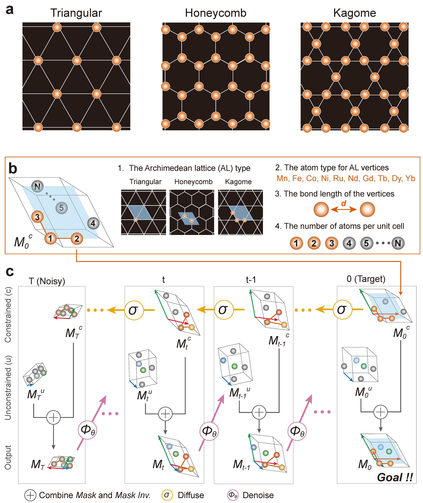

# Structural Constraint Integration in Generative Model for Discovery of Quantum Material Candidates

Implementation codes for crystal structure prediction by Joint equivariant diffusion with structural constraints.  

<p align="center">
  
</p>

### Dependencies

```
python==3.9.20   
torch==2.0.1+cu118   
torch-geometric==2.3.0   
pytorch_lightning==1.3.8   
pymatgen==2023.9.25   
hydra-core==1.1.0
hydra-joblib-launcher==1.1.5
e3nn==0.5.1
```

other libraries    
```

```


### Training

```
python scigen/run.py data=mp_20 model=diffusion_w_type expname=<expname>   
```


### Metastable structure generation

```
python script/generation.py --model_path <model_path> --label <label> --max_atom <max_atom>   
```


### Evaluation


### Set the config for evaluation task.    
eval_config.py 

### Convert the output into cif files.    
python script/save_cif.py 

#### Down-sample stable material structures, and save as CIF files (full source code will be released soon). 
python script/eval_stability.py    


## References
**Publication:**    
```     
@article{okabe2024structural,
  title={Structural Constraint Integration in Generative Model for Discovery of Quantum Material Candidates},
  author={Okabe, Ryotaro and Cheng, Mouyang and Chotrattanapituk, Abhijatmedhi and Hung, Nguyen Tuan and Fu, Xiang and Han, Bowen and Wang, Yao and Xie, Weiwei and Cava, Robert J and Jaakkola, Tommi S and others},
  journal={arXiv preprint arXiv:2407.04557},
  year={2024}
}    

https://arxiv.org/abs/2407.04557    
```     

**Dataset:**    

```     
https://arxiv.org/abs/2407.04557   
```     


