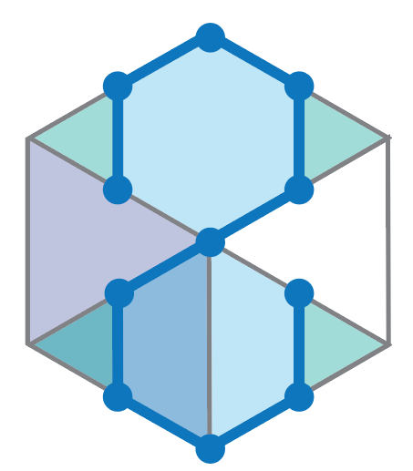

# Structural Constraint Integration in Generative Model for Discovery of Quantum Material Candidates

Implementation codes for crystal structure prediction by Joint equivariant diffusion with structural constraints.  

<p align="center">
  
</p>

<p align="center">
  
</p>

### Dependencies

```
python==3.9.20   
torch==2.0.1+cu118   
torch-geometric==2.3.0   
pytorch_lightning==1.3.8   
pymatgen==2023.9.25   
hydra-core==1.1.0
hydra-joblib-launcher==1.1.5
e3nn==0.5.1
```

other libraries    
```

```

# Config setting   
Set the configuration files 
- duplicate .env.template file and rename it as .env. Set the path PROJECT_ROOT, HYDRA_JOBS, WA


### Training
Use DiffCSP 

```
python scigen/run.py data=mp_20 model=diffusion_w_type expname=<expname>   
```

### Set the config for evaluation task.    
config_scigen.py   
- Set the configuration file 
- Whether to use the pre-trained model or use your own model. 

### Metastable structure generation
configuratioin 
batch_size = 10 # Number of materials to generate in one batch
num_batches_to_samples = 20 # Number of batches to sample
num_materials = batch_size * num_batches_to_samples
save_traj_idx = []  # List of indices to save trajectory
num_run = 1 # Number of runs
idx_start = 0   # Starting index
c_scale = None  # Scaling factor for c-axis. None for no constraint
c_vert = False   # Whether to constrain the c-axis to be vertical
header = 'sc'   # Header for the label
sc_list = ['tri']   # List of SCs to generate
atom_list = ['Mn', 'Fe', 'Co', 'Ni', 'Ru', 'Nd', 'Gd', 'Tb', 'Dy', 'Yb']

generate_cif = True if you want to generate cif file. (you can run it independently in the next chapter.)

```
python gen_mul.py 
```


### Convert the output into cif files.    
python script/save_cif.py    


### Generate movie of material generation.
python gen_movie.py   


## References
**Publication:**    
```     
@article{okabe2024structural,
  title={Structural Constraint Integration in Generative Model for Discovery of Quantum Material Candidates},
  author={Okabe, Ryotaro and Cheng, Mouyang and Chotrattanapituk, Abhijatmedhi and Hung, Nguyen Tuan and Fu, Xiang and Han, Bowen and Wang, Yao and Xie, Weiwei and Cava, Robert J and Jaakkola, Tommi S and others},
  journal={arXiv preprint arXiv:2407.04557},
  year={2024}
}    

https://arxiv.org/abs/2407.04557    
```     

**Dataset:**    
We store the generated material dataset.    
https://doi.org/10.6084/m9.figshare.c.7283062.v1    


