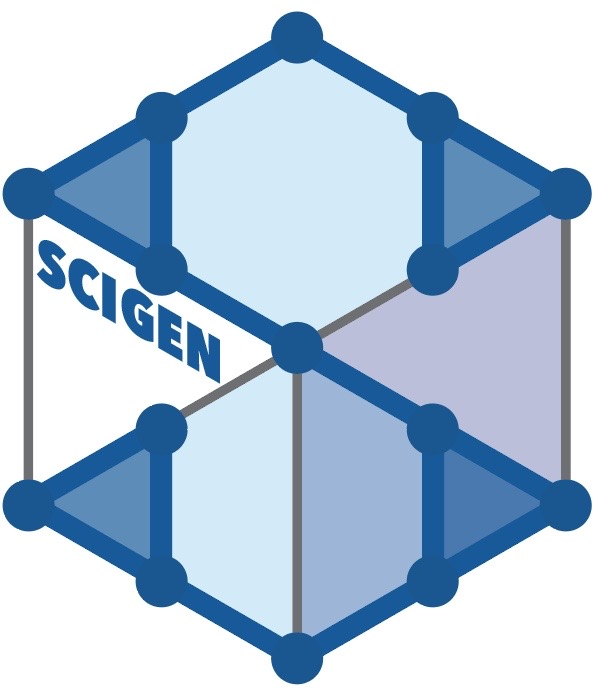

# Structural Constraint Integration in Generative Model for Discovery of Quantum Material Candidates
We present Structural Constraint Integration in the GENerative model (SCIGEN), a framework that integrates structural constraints, such as honeycomb or kagome motifs, into generative diffusion models, enabling the generation of materials with targeted geometric patterns. 

[https://arxiv.org/abs/2407.04557](https://arxiv.org/abs/2407.04557)

<p align="center">
  
</p>

<p align="center">
  
</p>

## Table of Contents
- [Dependencies](#dependencies)
- [Config Setting](#config-setting)
- [Training](#training)
- [Material Generation](#material-generation)
- [Convert Output to CIF Files](#convert-output-to-cif-files)
- [Filter Generated Materials by Pre-Screening Filters](#filter-the-generated-materials-by-pre-screening-filters)
- [Make Movies of Material Generation Trajectories](#make-movies-of-material-generation-trajectories)
- [References](#references)

---

## Dependencies

### Version-dependent libraries
```bash
python==3.9.20   
torch==2.0.1+cu118   
torch-geometric==2.3.0   
pytorch_lightning==1.3.8   
pymatgen==2023.9.25   
hydra-core==1.1.0
hydra-joblib-launcher==1.1.5
```

### Other libraries    
```bash
pandas
smact
wandb
imageio
...
```

---

## Config Setting   
Set the configuration files:
Duplicate `.env.template` file and rename it as `.env`. Modify the following environment variables in .env.   
`PROJECT_ROOT`: path to the folder that contains this repo.   
`HYDRA_JOBS`: path to a folder to store hydra outputs.   
`WANDB`: path to a folder to store wandb outputs.   

---

## Training

```bash
python scigen/run.py data=mp_20 model=diffusion_w_type expname=<expname>
```
- `exp_name`: The model name.  
- The trained model is saved in `HYDRA_JOBS/singlerun/yyyy-mm-dd/<expname>/`.

---

## Material Generation
Run the following to generate structures:
```bash
python gen_mul.py
```
### Configurations for material generation
Make a copy of the `config_scigen.template.py` file and rename it to `config_scigen.py`.
1. Use the pre-trained model:
   - Download the pre-trained model files:
```bash
wget https://figshare.com/ndownloader/articles/27778134/versions/1; unzip 1
```
   - Place the zip folder in the home directory (`PROJECT_ROOT`) and unzip it.
Edit `config_scigen.py` like:
```
home_dir = '/path/to/SCIGEN'
hydra_dir = home_dir
job_dir = 'models/mp_20'
```

2. Use the model you trained:
   - Set the configuration to specify the path to your model in hydra.
Edit `config_scigen.py` like:
```
home_dir = '/path/to/SCIGEN'
hydra_dir = 'path/to/HYDRA_JOBS/singlerun'
job_dir = 'yyyy-mm-dd/<expname>'
```

### Configuration

| Parameter              | Description                                                                                 | Default Value                           |
|------------------------|---------------------------------------------------------------------------------------------|-----------------------------------------|
| `batch_size`           | Number of materials to generate per batch.                                                 | `10`                                    |
| `num_batches_to_samples` | Number of batches to sample during generation.                                             | `20`                                    |
| `num_materials`        | Total number of materials to generate (`batch_size * num_batches_to_samples`).              | `batch_size * num_batches_to_samples`   |
| `save_traj_idx`        | Indices for which the generation trajectory will be saved.                                  | `[]` (We do not save the trajectory.)  |
| `num_run`              | Number of independent runs to perform.                                                     | `1`                                     |
| `idx_start`            | Starting index for labeling generated materials.                                            | `0`                                     |
| `header`               | Prefix for labeling the generated materials.                                                | `'sc'`                                  |
| `sc_list`              | List of structural constraints (e.g., triangular lattice).                                  | `['kag']`                               |
| `atom_list`            | Atomic species to include in the generated materials.                                       | `['Mn', 'Fe', 'Co', 'Ni', 'Ru', 'Nd', 'Gd', 'Tb', 'Dy', 'Yb']` |
| `c_scale`              | Scaling factor for the c-axis; For example, `1.0` gives the same lengths for lattice vector `L1` and `L2`. `None` means no constraint.                                  | `None`                                  |
| `c_vert`               | Whether to constrain the c-axis to be vertical.                                             | `False`                                 |
| `save_cif`         | Whether to save the generated materials as CIF files.                                       | `False`                                  |

### Structural Constraints
Select from the following lattice types: 
- **Triangular (tri)**, **Honeycomb (hon)**, **Kagome (kag)**, **Square (square)**, **Elongated (elt)**, **Snub square (sns)**, **Truncated square (tsq)**, **Small rhombitrihexagonal (srt)**, **Snub hexagonal (snh)**, **Truncated hexagonal (trh)**, **Lieb (lieb)**, **Vanilla model without structural constraint (van)**

<p align="center">
  
</p>

*For each structural constraint, the minimum/maximum number of atoms per unit cell can be specified in `sc_natm_range.py`.    

---

## Convert Output to CIF Files

Convert generated outputs into CIF files:
```bash
python script/save_cif.py --label <out_name>
```
- `out_name`: For example, `sc_kag200_000` indicates 200 materials generated with Kagome lattice constraints, indexed as `000`. See the output file from `gen_mul.py`.
- If `out_name` is set in `config_scigen.py`, you do not need to set `--label`.

---

## Filter the Generated Materials by Pre-Screening Filters

Pre-screen the generated materials based on stability, and save the CIF files of the screened materials.
```bash
python script/eval_screen.py --label <out_name>
```

Or process multiple outputs by running:
```bash
python screen_mul.py
```

Pre-screen the generated materials based on stability, and then save only magnetic materials.
```bash
python script/eval_screen.py --label <out_name> --screen_mag True
```

---

## Make Movies of Material Generation Trajectories

Set `out_name` in `config_scigen.py`, then run: 
```bash
python traj_movie.py
```
- Set `idx_list` in `traj_movie.py` to specify the indices of the materials for trajectory movie generation.

---

## References

### Publication
If you find our code or dataset useful, please cite the following paper:   
```plaintext
@article{okabe2024structural,
  title={Structural Constraint Integration in Generative Model for Discovery of Quantum Material Candidates},
  author={Okabe, Ryotaro and Cheng, Mouyang and Chotrattanapituk, Abhijatmedhi and Hung, Nguyen Tuan and Fu, Xiang and Han, Bowen and Wang, Yao and Xie, Weiwei and Cava, Robert J and Jaakkola, Tommi S and others},
  journal={arXiv preprint arXiv:2407.04557},
  year={2024}
}
```

### Dataset
We compile a comprehensive database of AL materials generated by SCIGEN. The dataset provides the folders of all generated materials (7.87 million), the materials that survived after the four-stage pre-screening process (790 thousand materials), and DFT-relaxed structures (24,743). The folder with DFT calculation contains materials structures before and after relaxation. The Supplementary dataset is available in Figshare repository:  
[https://doi.org/10.6084/m9.figshare.c.7283062.v1](https://doi.org/10.6084/m9.figshare.c.7283062.v1)

### Note to Users
The SCIGEN source code is continuously being improved for better readability, ease of use, and broader applicability. If you encounter any issues or have suggestions for enhancement, please don't hesitate to open an issue in this GitHub repository. You can also directly reach out to the main author, Ryotaro Okabe, (rokabe [at] mit [dot] edu). Your feedback is greatly appreciated!
